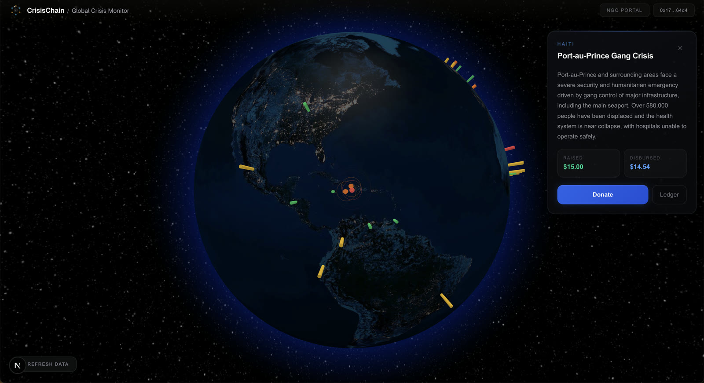
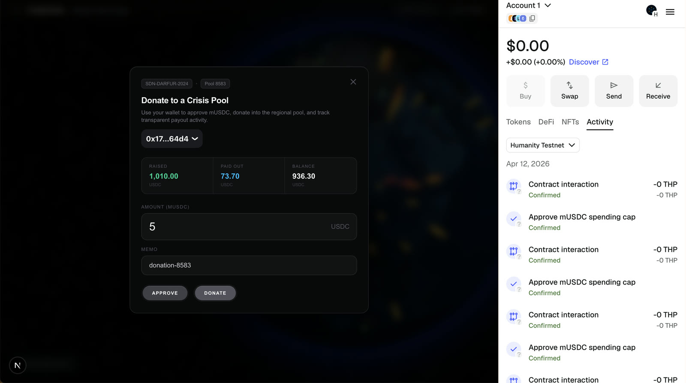
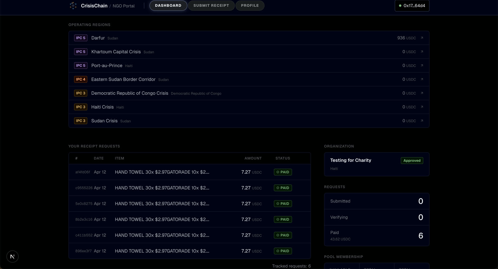
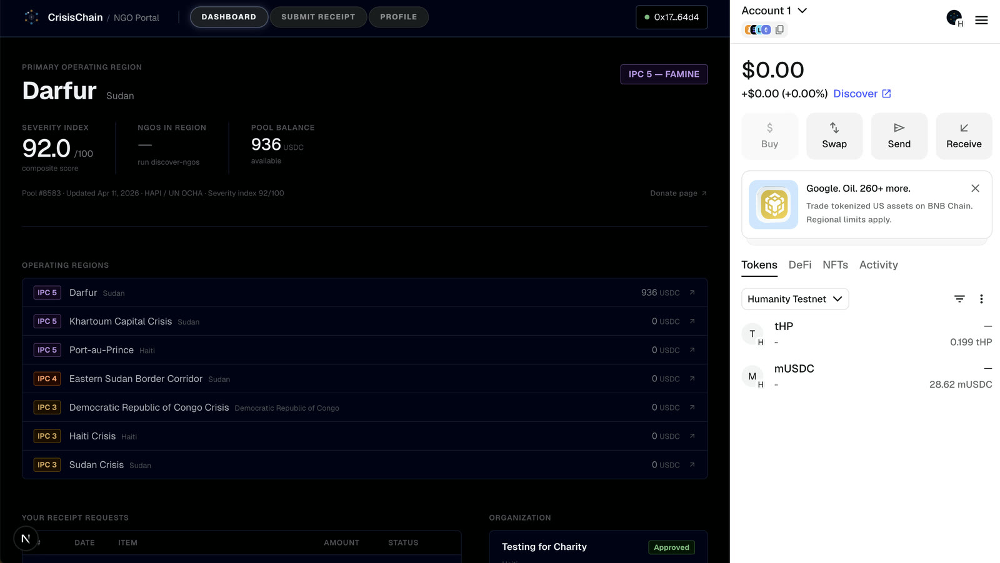
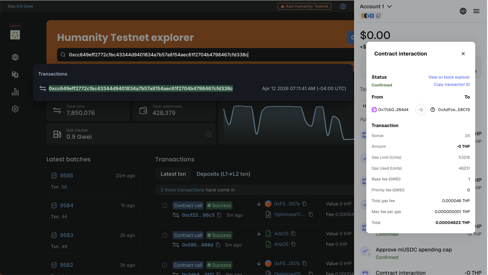
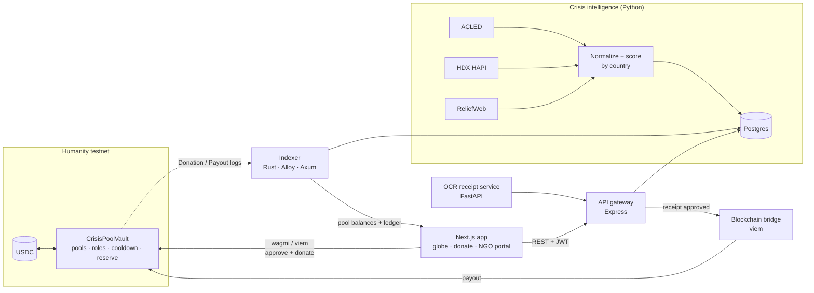

<h1 align="center">CrisisChain</h1>

<p align="center">
  <b>On-chain humanitarian aid. Donors fund a regional crisis pool, NGOs upload a receipt, and the pool pays them back in the same session, with every step on a public ledger.</b>
</p>

<p align="center">
  🏆 <b>People's Choice Award</b> and <b>Community Prize</b>, MIT Bitcoin Hackathon 2026 ·
  <a href="https://devpost.com/software/princeton-hackathon">Devpost</a>
</p>

<p align="center">
  <a href="https://github.com/aikhanjum/crisis-chain/actions/workflows/ci.yml"></a>
  
  
  
  
</p>

<p align="center">
  
</p>

## The problem

When a crisis hits, donated money moves through several intermediaries and international wires that take weeks. Donors cannot see where it went, and field NGOs often front the cost of supplies and wait to be paid back. The rails to move money globally in seconds already exist. Nobody had put aid on them in a way a relief worker could actually use.

## What it does

1. **Crisis data picks the regions.** A pipeline pulls live conflict and humanitarian data (ACLED, HDX HAPI, ReliefWeb), normalizes it by country, and scores each region's severity. Regions show up on a 3D globe with their IPC level.
2. **Donors fund a region, not an organization.** Connect a wallet, approve USDC, and `donate()` into that region's pool on `CrisisPoolVault`. The donation is an on-chain event anyone can audit.
3. **NGOs buy supplies and upload the receipt.** OCR pulls the line items, which are checked against an approved items list with price caps (food, water, medicine, shelter, hygiene).
4. **The pool pays them back.** An approved receipt triggers `vault.payout()` from that region's pool straight to the NGO's wallet. The vault enforces a 48 hour per NGO cooldown and keeps a 10% reserve, so no single claim can drain a pool.
5. **Everyone sees the same ledger.** A Rust indexer follows every `Donation` and `Payout` event into Postgres and serves pool balances and history to the app.

Demo run on Humanity testnet: 1,010 mUSDC raised into the Darfur pool, six receipts paid out to an NGO's wallet, each one a confirmed transaction on the explorer.

<table>
  <tr>
    <td width="50%"><br><sub>Donate into a regional pool. Raised, paid out and balance come from the indexer.</sub></td>
    <td width="50%"><br><sub>NGO portal. Six receipts reimbursed from the vault.</sub></td>
  </tr>
  <tr>
    <td width="50%"><br><sub>NGO dashboard. Severity index, pool balance and every region the NGO operates in.</sub></td>
    <td width="50%"><br><sub>The same payout on the public block explorer.</sub></td>
  </tr>
</table>

## Architecture



| Component | Stack | What it does |
| --- | --- | --- |
| [`contracts/`](contracts) | Solidity 0.8.26, Foundry, OpenZeppelin | Pool vault plus six supporting contracts, 90 tests |
| [`crates/indexer/`](crates/indexer) | Rust, Alloy, Axum, sqlx | Follows vault events into Postgres, serves pool state over HTTP |
| [`apps/web/`](apps/web) | Next.js, React 19, wagmi, viem, RainbowKit, react-globe.gl | Globe, donate flow, NGO portal, ledger |
| [`services/api-gateway/`](services/api-gateway) | Express, TypeScript | Wallet sign-in (nonce + signature → JWT), regions, NGO and receipt routes |
| [`services/blockchain-bridge/`](services/blockchain-bridge) | Node, viem | The only service holding an operator key. Grants roles and executes payouts |
| [`services/crisis-intelligence/`](services/crisis-intelligence) | FastAPI, APScheduler | ACLED, HDX and ReliefWeb ingestion, severity scoring, NGO discovery |
| [`services/ocr-receipt/`](services/ocr-receipt) | FastAPI, Tesseract / Google Vision | Receipt line items matched to approved categories and price caps |
| [`services/ai-summary/`](services/ai-summary) | FastAPI, Claude API | Plain language crisis briefs for each region |

## Smart contracts

| Contract | Idea | Tests |
| --- | --- | --- |
| [`CrisisPoolVault`](contracts/src/CrisisPoolVault.sol) | One vault, many regional pools keyed by `poolId`. Role gated payouts, pause switch, per recipient cooldown, minimum reserve in basis points, custom errors that say exactly why a payout failed | 14 |
| [`ProofOfDelivery`](contracts/src/ProofOfDelivery.sol) | Replaces a single trusted approver with weighted signals (receipt oracle, geo oracle, peer NGO, beneficiary). Payout fires on its own when the confidence score crosses a threshold, lower for NGOs with a long verified history | 25 |
| [`EIP712Reimbursement`](contracts/src/EIP712Reimbursement.sol) | Approver signs a typed reimbursement off chain, anyone can submit it. Nonces stop replay, deadlines stop stale approvals | 7 |
| [`MerkleDistributor`](contracts/src/MerkleDistributor.sol) | Pay N approved claims with one root on chain. NGOs claim with a proof, a bitmap blocks double claims, expired rounds refund | 11 |
| [`SoulboundCredential`](contracts/src/SoulboundCredential.sol) | Non transferable ERC-721 as an NGO's verified identity. Every transfer path reverts | 12 |
| [`ApprovedItemsRegistry`](contracts/src/ApprovedItemsRegistry.sol) | On chain allowlist of supply categories with per unit price caps | 12 |
| [`YieldVault`](contracts/src/YieldVault.sol) | ERC-4626 wrapper so idle donations can earn yield until a crisis pool needs them (yield is simulated on testnet) | 9 |

The live demo runs donations and payouts through `CrisisPoolVault`. The other six are built, tested and deployable with `DeployAll.s.sol`, and are the path from "an admin approves a receipt" to "nobody has to".

## Engineering notes

**An indexer that cannot double count.** The Rust indexer only reads blocks that are a configurable number of confirmations behind the head, so a short reorg never reaches the database. It pulls logs in small chunks to stay inside free tier RPC limits, writes the events and its block cursor in one Postgres transaction, and inserts with `ON CONFLICT (tx_hash, log_index) DO NOTHING`. A crash at any point replays safely, and each event lands exactly once.

**Trust without one trusted party.** The easy design is one admin key that approves every reimbursement. That is a single point of fraud and exactly what aid systems already suffer from. `ProofOfDelivery` makes approval a weighted vote of independent signals and pays automatically when enough of them agree. `EIP712Reimbursement` and `MerkleDistributor` cover the cases where a human approver is still needed, without that human paying gas per claim.

**Guardrails in the contract, not the UI.** Cooldown and reserve checks live in `payout()` itself, so a compromised backend still cannot drain a pool in one call. Admin can bypass them only through a separate role meant for emergencies.

**Making crypto invisible.** A relief worker should never need to know what gas is. NGOs sign in with their wallet once and get a normal session. Blockchain terms were stripped from the NGO portal, and the bridge service, not the NGO, pays for the payout transaction.

**One key, one service.** Only the blockchain bridge holds an operator key. The gateway, the web app and the data services never touch it, so the blast radius of a leaked secret is one small, auditable service.

## Run it

Full runbook, with every env var, port and the NGO flow step by step, is in **[docs/RUNBOOK.md](docs/RUNBOOK.md)**. The short version:

```bash
git clone --recursive https://github.com/aikhanjum/crisis-chain.git && cd crisis-chain
cp .env.example .env && cp apps/web/.env.example apps/web/.env.local   # fill in RPC, keys, addresses

cd contracts && forge test && cd ..                # 90 tests, no network needed
docker compose up -d postgres                      # schema and seed load on first start
cargo run -p indexer                               # :3001
(cd services/api-gateway && npm i && npm run dev)  # :4000
(cd apps/web && npm i && npm run dev)              # :3000
```

## Team

Built at the MIT Bitcoin Hackathon 2026 by
[Aikhan Jumashukurov](https://github.com/aikhanjum) ·
[Patrick Fu](https://github.com/trickfu) ·
[Vishrut Thoutam](https://github.com/VisH317) ·
[David Kwon](https://github.com/DHyukjuK) ·
[Isaac Kang](https://github.com/Ik301)

## What's next

Geotagged receipts and photo proof of delivery, real stablecoins on a production network, a pilot with a field NGO, and mobile first NGO onboarding. Longer term, an open protocol any aid organization can plug into so funding follows need, not paperwork.

> Testnet prototype. Private keys in `.env` are for development only, and admin routes must be locked down before any real deployment. See [docs/RUNBOOK.md](docs/RUNBOOK.md#11-security).
